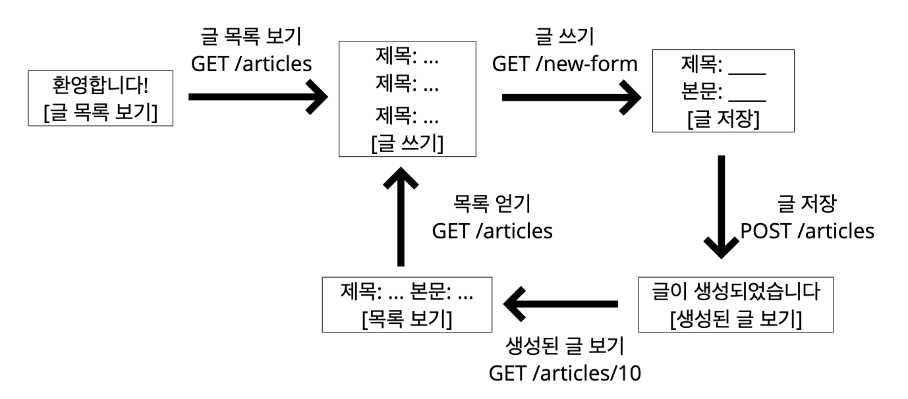

> 해당 post는 DEVIEW 2017 '[그런 REST API로 괜찮은가](https://deview.kr/2017/schedule/212)'에 기반하여 작성되었습니다

## REST

>  REpresentational State Transfer
>
>  a way of providing interoperability between computer systems on the Internet


## REST 가 나오게 된 계기

### WEB (1991)

Q: 어떻게 인터넷에서 정보를 공유할 것인가?

A: 정보들을 하이퍼텍스트로 연결한다. 

- 표현 형식: HTML
- 식별자: URI
- 전송 방법: HTTP


### HTTP/1.0 (1994-1996)

>  HTTP 1.0 이 나오기 전에 이미 웹이 급속도로 성장하고 수많은 웹서버들이 존재하였다.

HTTP 명세의 저자중 한명인 Roy T. Fielding

Q : "[How do I improve HTTP **without breaking the Web**?](https://www.infoq.com/articles/roy-fielding-on-versioning/)" 

A: HTTP Object Model 

이것이 4년후에 REST(1998)란 이름으로 발표가 된다

### REST(1998)

- Roy T. Fielding, Microsoft Research에서 발표 (*"[Representational State Transfer: An Architectural Style for Distributed Hypermedia Interaction](http://roy.gbiv.com/talks/webarch_9805/index.htm)"*)

- 2년뒤 2000년에 박사 논문으로 발표 (*"[Architectural Styles and the Design of Network-based Software Architectures](https://www.ics.uci.edu/~fielding/pubs/dissertation/top.htm)"*)


## API의 history

### XML-RPC(1998)

- Microsoft에서 발표한 원격으로 다른 시스템의 메소드를 호출할 수 있는 프로토콜을 만들었다
- 나중에 **SOAP**이라는 이름으로 불리게 된다.

### Salesforce API (2000.2)

- 인터넷에서 거의 최초에 공개한 API
- SOAP으로 공개

```xml
<?xml version="1.0" encoding="utf-8"?>   
<soapenv:Envelope xmlns:soapenv="http://schemas.xmlsoap.org/soap/envelope/"
  xmlns:urn="urn:enterprise.soap.sforce.com">
  <soapenv:Header>
     <urn:SessionHeader>
        <urn:sessionId><b>QwWsHJyTPW.1pd0_jXlNKOSU</b></urn:sessionId>
     </urn:SessionHeader>
  </soapenv:Header>
  <soapenv:Body>
        <urn:fieldList><b>Id, Name, Website</b></urn:fieldList>
        <urn:sObjectType><b>Account</b></urn:sObjectType>
        <!--Zero or more repetitions:-->
        <urn:ids><b>001D000000HS2Su</b></urn:ids>
        <urn:ids><b>001D000000HRzKD</b></urn:ids>
     </urn:retrieve>
  </soapenv:Body>
</soapenv:Envelope>
```

### flickr API (2004.8)

**SOAP**

```xml
<?xml version="1.0" encoding="utf-8" ?>
<s:Envelope xmlns:s="http://www.w3.org/2001/06/soap-envelope">
	<s:Body>
		<s:Fault>
			<faultcode>flickr.error.[error-code]</faultcode>
			<faultstring>[error-message]</faultstring>
			<faultactor>http://www.flickr.com/services/soap/</faultactor>
			<details>Please see http://www.flickr.com/services/docs/ for more details</details>
		</s:Fault>
	</s:Body>
</s:Envelope>
```

**REST**

```xml
<?xml version="1.0" encoding="utf-8" ?>
<rsp stat="fail">
	<err code="[error-code]" msg="[error-message]" />
</rsp>
```


**SOAP과 REST의 직관적 비교**

| SOAP        | REST        |
| ----------- | ----------- |
| 복잡하다    | 단순하다    |
| 규칙이 많다 | 규칙이 적다 |
| 어렵다      | 쉽다        |


- REST가 SOAP의 인기를 넘어선다
- [2006년, AWS 가 자사 API의 사용량의 85%가 REST임을 밝힌다](https://aws.amazon.com/ko/blogs/aws/rest_and_soap/#pageNotTranslated)
- 2010년, Salesforce.com, REST API 추가


## REST 에 대한 오해

### CMIS(*Content Management Interperability Services*) (2008)

- CMS를 위한 표준
- EMC, IBM, Microsoft등이 함께 작업
- **REST 바인딩 지원**

```
Roy T. Fielding
"No REST in CMIS"
```

### [Microsoft REST API Guidelines(2016)](https://github.com/Microsoft/api-guidelines)

- URI는 `https://{serviceRoot}/{collection}/{id}` 형식이어야 한다
- GET, PUT, DELETE, POST, HEAD, PATCH, OPTIONS를 지원해야한다
- API 버저닝은 Major.minor로 하고 URI에 버전 정보를 포함시킨다.
- 등등...

```
"s/REST API/HTTP API/"
-- Roy T. Fielding
```

---

```
"REST APIs must be hypertext-driven"

Q: REST API를 위한 최고의 버저닝 전략은 무엇인가?
A: "REST API를 위한 최고의 버저닝 전략은 버저닝을 안 하는 것"
-- Roy T. Fieldinga
```

## REST 란?

- 분산 하이퍼미디어 시스템(예: 웹)을 위한 아키텍쳐 스타일

### 아키텍쳐 스타일

- 제약 조건들의 집합

### REST 를 구성하는 스타일 (하이브리드 아키텍쳐 스타일)

- client-server
- stateless
- cache
- **Uniform interface**
- layered system
  - 요청된 정보를 검색하는 데 관련된 서버(보안, 로드 밸런싱 등을 담당)의 각 유형을 클라이언트가 볼 수 없는 계층 구조로 체계화하는 계층화된 시스템
- Code-on-demand (optional)
  - 서버에서 코드를 클라이언트로 보내서 실행시킬 수 있어야한다. 
  - 예 - javascript


대부분 조건들은 잘 지켜지지만 **Uniform interface** 를 잘 지키지 못하고 있다


### Uniform Interface의 제약조건

- Identification of resources
  - [resource가 uri로 식별되면 된다](https://restfulapi.net/resource-naming/)
  - ex) /customers/{customerId}/accounts/{accountId}
- manipulation of resources through representations
  - Representation 전송을 통해서 resource를 조작해야한다.
- **self-descriptive messages**
- **hypermedia as the engine of application state (HATEOAS)**

#### Self-decriptive message

- 메시지는 스스로를 설명해야한다

```
GET/ HTTP/1.1
```
- not self-descriptive (목적지가 빠져 있다)
---

```
GET/ HTTP/1.1
Host: www.example.org
```
- self-descriptive

- 또 다른 예 )

```http
HTTP/1.1 200 OK

[ { "op": "remove", path: "/a/b/c" } ]
```
  - 본문의 내용을 해석불가 (어떻게 해석해야할지 모르기 때문에)
  - 따라서 `Content-type header` 추가

```http
HTTP/1.1 200 OK
Content-Type: application/json

[ { "op": "remove", path: "/a/b/c" } ]
```
  - 각 필드가 의미하는 바를 정확히 설명할수 없다

```http
HTTP/1.1 200 OK
Content-Type: application/json-patch+json

[ { "op": "remove", path: "/a/b/c" } ]
```

  - [*json-pathc+json*](https://www.rfc-editor.org/rfc/rfc6902.html)의 명세를 보고 메시지를 해석할 수 있다.

- 따라서, 대부분의 REST API라 부르는 것은 이 조건을 만족하지 못한다

  - 메시지만 보고서 각각의 의미하는 바를 정확히 설명하지 못하기 때문에...

#### HATEOAS

- 애플리케이션의 상태는 Hyperlink를 이용해 전이되어야한다



- html의 경우에는 a 태크를 통해 상태를 전이하기 때문에 HATEOAS를 만족한다.

```http
HTTP/1.1 200 OK
Content-Type: text/html

<html>
<head></head>
<body><a href="/test">test</a></body>
</html>
```

- API

```http
HTTP/1.1 200 OK
Content-Type: application/json
Link: </articles/1>; rel="previous", </articles/3>; rel="next";

{
	"title": "The second article",
	"Contents": "blah blah..."
}
```


### 그럼 왜 Uniform Interface를 지켜야 하는가?

**독립적 진화**를 위해

- 서버와 클라이언트가 각각 독립적으로 진화한다
- **서버의 기능이 변경되어도 클라이언트를 업데이트할 필요가 없다**
- REST를 만들게 된 계기: "How do I improve HTTP without breaking the Web." 


### REST가 잘 지켜져 있는가?

#### 웹은 REST를 아주 잘 지키고 있다

- 웹 페이지를 변경했다고 웹 브라우저를 업데이트할 필요는 없다
- 웹 브라우저를 업데이트했다고 웹 페이지를 변경할 필요도 없다.
- HTTP 명세가 변경되어도 웹은 잘 동작한다.
- HTML 명세가 변경되어도 웹은 잘 동작한다.

#### how?

- W3C Working groups, IETF Working groups, 웹 브라우저 개발자들, 웹 서버 개발자들의 노력
- 하위 호환성을 깨뜨리지 않기 위해 굉장히 많은 노력을 한다

**사례**

- HTML5 첫 초안에서 권고안 나오는데까지 6년

- HTTP/1.1 명세 개정판 작업하는데 7년
  - 하지만 추가된 기능은 없다.

**상호운용성 (interoperability)**에 대한 집착

- Referer 오타지만 안고침 - 원래는 Referrer 이다.
- charset 잘못 지은 이름이지만 안 고침
  - 사실상 encoding이 더 맞는 표현이다.
- HTTP 상태 코드 416 포기함 (I'm a teapot)
  - 만우절때 만든 HTCPC가 416 상태코드를 만들었다.
  - 수많은 서버 구현체들이 (ex. Node.js, go lang) 이것을 http 상태코드를 구현하였다. 
  - 따라서 영구 결번이 되었다.
- HTTP/0.9 아직도 지원함 (크롬, 파이어폭스)
  - 크롬에서 HTTP/0.9 를 뺐었던 때가 있는데 일부 proxy에서 오작동이 발견 되었다.

#### REST 가 웹의 독립적 진화에 도움을 주었나

- http에 지속적으로 영향을 줌
  - host 헤더 추가
  - 길이 제한을 다루는 방법이 명시 (414 URI Too Long 등)
- URI 에서 리소스의 정의가 추상적으로 변경됨: `문서의 위치` -> `식별하고자 하는 무언가`
- 기타 HTTP와 URI에 많은 영향을 줌
- HTTP/1.1 명세 최신판에서 REST에 대한 언급이 들어감
- Reminder: Roy T.Fidding이 HTTP와 URI 명세의 저자 중 한명

#### 그럼 REST가 성공했는가

- REST는 웹의 독립적 진화를 위해 만들어졌다.
- 웹은 독립적으로 진화하고 있다.

#### 하지만 REST API는?

- REST API는 REST 아키텍쳐 스타일을 따라야한다.
- 오늘날 스스로 REST API라고 하는 API들의 대부분이 REST 아키텍쳐 스타일을 따르지 않는다.

#### REST API도 저 제약조건들을 다 지켜야 하는건가?

```
An API that provides network-based access to resources via a uniform interface of 
self-descriptive messages containing hypertext to indicate potential state 
transitions might be part of an overall system that is a RESTful application
-- Roy T. Fielding
```

- [ref](https://www.slideshare.net/ColdFusionConference/a-bit-of-rest#36)

#### 그럼 API는 꼭 REST API 여야 하는가?

```
REST emphasizes evolvability to sustain an uncontrollable system. 
If you think you have control over the system or aren’t interested in evolvability, 
don’t waste your time arguing about REST.

시스템 전체를 통제할수 있다고 생각하거나, 진화에 관심이 없다면, REST에 대해 따지느라 시간을 낭비하지 마라
-- Roy T. Fielding
```
---
```
I am getting frustrated by the number of people calling any HTTP-based interface a REST API.
...
Please try to adhere to them or choose some other buzzword for your API.

제발 REST를 지키던지 아니면 다른단어를 써라.
-- Roy T. Fielding
```

- [ref](https://www.slideshare.net/AEMHub2014/rest-in-aem-by-roy-fielding#39)


### API 에서 REST를 지키기 어려운 이유

일단 왜 API는 REST가 잘 안되나 일반적인 웹과 비교를 해보자

|              | 흔한 웹 페이지 | HTTP API  |
| ------------ | -------------- | --------- |
| Protocol     | HTTP           | HTTP      |
| 커뮤니케이션 | 사람-기계      | 기계-기계 |
| Media Type   | HTML           | JSON      |

|                  | HTML               | JSON               |
| ---------------- | ------------------ | ------------------ |
| Hyperlink        | 된다 ( a 태그 등 ) | 정의되어 있지 않음 |
| Self-descriptive | 된다 ( HTML 명세 ) | 불완전 *           |

#### 비교

##### HTML

```html
GET /todos HTTP/1.1
Host: example.org

HTTP/1.1 200 OK
Content-Type: text/html

<html>
  <body>
    <a href="https://todos/1">회사 가기</a>
    <a href="https://todos/1">집에 가기</a>
  </body>
</html>
```

**Self-descriptive (o)**

1. 응답 메시지의 Content-Type을 보고 media type이 text/html 임을 확인한다.
2. HTTP 명세에 media type은 IANA에 등록되어있다고 하므로, IANA에서 text/html의 설명을 찾는다.
3. IANA에 따르면 text/html의 명세는 http://www.org/TR/html 이므로 링크를 찾아가 명세를 해석한다.
4. 명세에 모든 태그의 해석방법이 구체적으로 나와있으므로 이를 해석하여 문서 저자가 사용자에게 태그를 어떻게 해석할지 알려줄 수 있다.

**HATEOAS (o)**

- a 태그를 이용해 표현된 링크를 통해 다음 상태로 전이될 수 있으므로 HATEOAS를 만족한다.


##### JSON

```json
GET /todos HTTP/1.1
Host: example.org

HTTP/1.1 200 OK
Content-Type: application/json

[
  {"id": 1, "title": "회사 가기"},
  {"id": 2, "title": "집에 가기"},
]
```

**Self-descriptive (x)**

1.  응답 메시지의 Content-Type을 보고 media type이 application/json 임을 확인한다.
2.  HTTP 명세에 media type은 IANA에 등록되어있다고 하므로, IANA에서 application/json의 설명을 찾는다.
3.  IANA에 따르면 application/json의 명세는 draft-ieftt-jsonbis-rfc7159bis-04이므로 링크를 찾아가 명세를 해석한다.
4.  명세에 json 문서를 파싱하는 방법이 명시되어있으므로 성공적으로 파싱에 성공한다. **그러나 "id"가 무엇을 의미하고, "title"이 무엇을 의미하는지 알 방법은 없다.**

**HATEOAS (x)**

- 다음 상태로 전이할 링크가 없다

#### 그런데 self-descriptive와 hateoas가 독립적 진화에 어떻게 도움이 될까?

**Self-descriptive**

확장 가능한 커뮤니케이션

- 서버나 클라이언트가 변경되더라도 오고가는 메시지는 언제나 self-descriptive 하므로 언제나 해석이 가능하다.

**HATEOAS**

애플리케이션 상태 전이의 late binding

- 어디서 어디로 전이가 가능한지 미리 결정되지 않는다. 어떤 상태로 전이가 완료되고 나서야 그 다음 전이될 수 있는 상태가 결정된다. - 링크는 동적으로 변경될 수 있다.


### REST-API로의 변경

#### Self-descriptive

**방법 1: Media type**

```json
GET /todos HTTP/1.1
Host: example.org

HTTP/1.1 200 OK
Content-Type: application/vnd.todos+json

[
  {"id": 1, "title": "회사 가기"},
  {"id": 2, "title": "집에 가기"},
]
```


1. 미디어 타입을 하나 정의
2. 미디어 타입 문서를 작성한다. 이 문서에 "id"가 뭐고 "title"이 뭔지 의미를 정의한다
3. [IANA에 미디어 타입을 등록한다](https://www.iana.org/form/media-types). 이 때 만든 문서를 미디어 타입의 명세로 등록한다.
4. 이제 이 메시지를 보는 사람은 명세를 찾아갈 수 있으므로 이 메시지의 의미를 온전히 해석할 수 있다

단점: 매번 media type을 정의해야한다.


**방법2: profile**

```json
GET /todos HTTP/1.1
Host: example.org

HTTP/1.1 200 OK
Content-Type: application/json
Link: <https://example.org/docs/todos>; rel="profile"

[
  {"id": 1, "title": "회사 가기"},
  {"id": 2, "title": "집에 가기"},
]
```

1. "id"가 뭐고 "title"이 뭔지 의미를 정의한 명세를 작성한다.
2. Link 헤더에 profile relation으로 해당 명세를 링크한다.
3. 이제 메시지를 보는 사람은 명세를 찾아갈 수 있으므로 이문서의 의미를 온전히 해석할 수 있다.

단점:

1. 클라이언트가 Link 헤더([RFC 5988](https://www.rfc-editor.org/rfc/rfc5988.html))와 profile([RFC 6906](https://www.rfc-editor.org/rfc/rfc6906.html))을 이해해야 한다.
2. Content negotiation을 할 수 없다.


#### HATEOAS

**방법1: data로**

```json
GET /todos HTTP/1.1
Host: example.org

HTTP/1.1 200 OK
Content-Type: application/json
Link: <https://example.org/docs/todos>; rel="profile"

[
  {
		"link": "https://example.org/todos/1",
    "title": "회사 가기"
  },
  {
		"link": "https://example.org/todos/2",
    "title": "집에 가기"
  }s
]
```

---

```json
GET /todos HTTP/1.1
Host: example.org

HTTP/1.1 200 OK
Content-Type: application/json
Link: <https://example.org/docs/todos>; rel="profile"

{
  "links": {
    "todo": "https://example.org/todos/{id}"
  },
  "data": [
    {"id": 1, "title": "회사 가기"},
    {"id": 2, "title": "집에 가기"}
  ]
}
```

data에 다양한 방법으로 하이퍼링크를 표현한다.

단점:

- 링크를 표현하는 방법을 직접 정의해야한다.

```json
GET /todos HTTP/1.1
Host: example.org

HTTP/1.1 200 OK
Content-Type: application/vnd.todos+json

{
  "data": [{
    "type": "todo",
    "id": "1",
    "attributes": { "title": "회사 가기" },
    "links": { "self": "https://example.com/todos/1" }
  },{
    "type": "todo",
    "id": "2",
    "attributes": { "title": "집에 가기" },
    "links": { "self": "https://example.com/todos/2" }
  }]
}
```

JSON으로 하이퍼링크를 표현하는 방법을 정의한 명세들을 활용한다.

- JSON API
- HAL
- UBER
- Siren
- Collection + json
- ....

단점: 기존 API를 많이 고쳐야한다.


**방법2: HTTP 헤더로**

```json
POST /todos HTTP/1.1
Content-Type: application/json

{
  "title": "점심 약속"
}

HTTP/1.1 204 No Content
Location: /todos/1
Link: </todos/>; rel="collection"
```

단점: 정의된 relation만 활용한다면 표현에 한계가 있다.

> 따라서, data, 헤더 모두 활용하면 좋습니다.
>
> Spring을 사용한다면 [Spring HATEOAS](https://docs.spring.io/spring-hateoas/docs/current/reference/html/#reference)를 사용해보자


Media type 등록은 필수 인가?

- NO
- 하지만 하면 더 좋다
- 너가 의도한 저자가 그 media type을 이해하고 있으면 할 필요는 없다.

media type을 IANA에 등록하기

- 누구나 쉽게 사용할 수 있게 된다.
- 이름 충돌을 피할 수 있다.
- 등록이 별로 어렵지 않다(고 주장함)


## TL; DR

- 오늘날 대부분의 "REST API"는 사실 REST를 따르지 않고 있다.
- REST의 제약조건 중에서 특히 **Self-descriptive** 와 **HATEOAS** 를 잘 만족하지 못한다.
- REST는 긴 시간에 걸쳐(수십년) 진화하는 웹 애플리케이션을 위한 것이다.
- REST를 따를 것인지는 API를 설계하는 이들이 스스로 판단하여 결정해야한다.
- REST를 따르겠다면, **Self-descriptive**와 **HATEOAS** 를 만족시켜야한다.
  - Self-descriptive는 **custom media type**이나 **profile link relation** 등으로 만족시킬 수 있다.
  - HATEOAS는 HTTP 헤더나 본문에 **링크** 를 담아 만족 시킬 수 있다
- REST를 따르지 않겠다면, "REST를 만족하지 않는 REST API"를 뭐라고 부를지 결정해야 할 것이다.
  - HTTP API라고 부를 수도 있고
  - 그냥 이대로 REST API라고 부를 수도 있다.


### Ref

- https://deview.kr/2017/schedule/212
- https://restfulapi.net/

