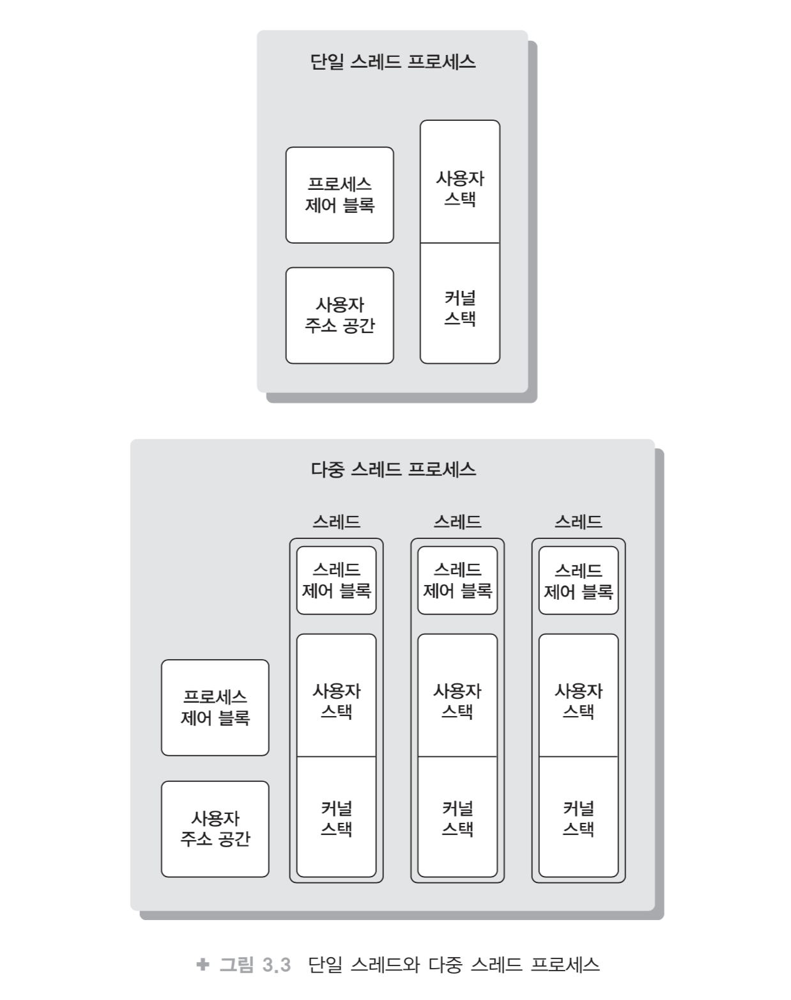

# OS ? Oh Yes! 3장 정리

### 3장 프로세스와 스레드

##### 3.1.1 프로세스 제어 블록 ( Process Control Block , PCB)

하나의 프로세스가 만들어져 없어질 때까지 시스템에는 테이블 모양의 자료구조를 가지고 있다. 이를 PCB라고 부른다. 다시 말해 프로세스 하나가 만들어진다는 것은 곧, 그 프로세스에 대한 모든 것을 표현하는 PCB 하나가 만들어진다는 말과 같다. 운영체제가 프로세스를 관리한다는 것은 바로 해당 PCB에 대한 다양한(만들고, 수정하고 관련 리스트로 연결, 지우고 하는) 행동으로 이해하면 되며, 프로세스의 수가 많음을 감안할 때 PCB에 대한 작업은 매우 빈번한 일이라서 PCB는 기본적으로 메모리에 저장시킨다.

PCB에 저장되는 정보들은 운영체제마다 조금씩 차이는 있지만 일반적으로 다음과 같은 정보들을 저장한다.

- 프로세스 번호 (Process Identification Number, PID). 
  - 프로세스의 고유한 정수 번호이며 다른 프로세스와의 구별을 위해 사용된다.
- 프로세스의 상태 (Status).
  - 준비, 실행, 대기, 보류 등의 상태를 나타낸다
- 프로세스 우선순위 (Priority).
  - 스케줄링을 할 때 사용되는 우선순위이다.
- 프로그램 카운터 값.
  - 다음에 실행될 명령어의 주소 값을 가지고 있다.
- 메모리 포인터.
  - 프로그램과 데이터가 저장되어 있는 메모리 블록 위치와, 공유되는 메모리 블록들에 대한 포인터를 포함하고 있다.
- 문맥 데이터.
  - 문맥교환 시에 CPU 레지스터 값들을 저장하는 영역이다.
- 할당받은 자원들에 대한 목록.
  - 개방(Open)한 파일 등 할당받은 자원들의 정보이다.
- 계정 정보(Accounting Information). CPU를 사용한 시간 등의 정보이다.
- 입출력 정보.
  - 진행 중인 입출력 요구 등의 정보이다.

##### 3.1.2 프로세스의 상태(Process State) 와 변화

프로세스가 만들어져 시스템에 존재하는 동안 여러 가지 사건들에 의해 일련의 상태 변화를 거치게 된다. 기본적으로, 생성(Created), 준비(Ready), 실행(Running), 대기(Blocked), 보류 준비(Suspend Ready), 보류(Suspended Blocked), 종료(Terminated) 등이 있다.

그림 3.1은 각 상태의 상호 관계와 변화하는 경로를 보여주고 있다.

 [^그림 출처]

**생성**

- 사용자가 요청한 작업이 커널에 등록되고 PCB가 만들어져 프로세스가 만들어진 다음 준비나 보류 준비 상태로 되기 위해 잠시 거치는 상태.
- 메모리 공간을 검사하여 충분한 공간이 있으면 메모리를 할당하면서 준비상태로 변화
- else, 보류준비 상태로 변화

**준비**

- CPU를 할당받기 위해 기다리고 있는 상태
- CPU만 주어지면 바로 실행할 준비가 되어 있는 상태
- 다중 프로그래밍 시스템의 경우 준비 상태의 여러 프로세스들은 메모리에 적재되어 있으며 CPU를 할당받기를 기다리고 있는데 이들을 위해 큐(또는 리스트)가 사용
- 준비 상태의 프로세스들은 순서에 따라 CPU를 할당받으면 실행 상태가 되는데 이때 순서를 정하는 것을 CPU 스케줄링

**실행**

- CPU를 할당받아 실행 중인 상태
  - Dispatch(디스패치) - CPU를 할당하는 것
- 실행 상태의 프로세스는 CPU 스케줄링 정책에 의해 CPU를 뺏길 수 있으며 이 경우 준비 상태로 변화
- 시간 할당량(Time Quantum)이 소진되어 뺏길 때를 시간 종료(Timeout) - 이 경우도 인터럽트가 동원되어 처리
- 실행 상태의 프로세스가 입출력이 필요하게 되어 시스템 호출을 하면 입출력 처리의 종료를 기다리면서 대기 상태로 바뀌게 되고 CPU는 바로 준비 상태의 프로세스들 중에서 하나를 선택해 실행

**대기**

- 프로세스가 실행되다가 입출력 처리를 요청하거나, 바로 확보될 수 없는 자원을 요청하면 CPU를 양도하고 요청한 일이 완료되기를 기다리면서 대기하는 상태
- 대기 상태의 프로세스들 역시 이들의 관리를 위해 큐(또는 리스트)가 사용
- 요청한 일이 완료되면 다시 실행 차례를 기다리기 위해 준비 상태로 바뀌면서 준비 큐에 들어간다

**종료**

- 프로세스가 종료될 때 아주 잠시 거치는 상태
- 프로세스는 할당되었던 모든 자원들이 회수되고 PCB만 커널에 남아있는 상태
- 운영체제가 시스템에 남겨져 있는 이 프로세스의 흔적들을 최종 정리 후 PCB를 삭제하면 프로세스가 완전히 사라진다

**보류**

- 프로세스가 메모리 공간을 뺏기고 디스크로 나가야 하는 것을 의미 - Swapped Out
- 나중에 다시 메모리로 들어오는 것 - Swapped In
- Swapping - Swapped Out & In

**보류 준비**

- 생성된 프로세스가 바로 메모리를 받지 못할때 or 준비 또는 실행 상태에서 메모리를 잃게 될 때
- 실행 상태의 프로세스가 CPU를 반납하면서 준비 상태로 바뀔 때 메모리 공간까지 잃어야 하는 경우라면 보류 준비 상태로 바뀌게(Suspended) 된다.
- 충분한 메모리 공간의 확보를 위해 준비 상태의 프로세스를 보류시킬 수밖에 없을 경우, 높은 우선순위의 보류 대기 상태 프로세스가 준비 상태가 되면서 실행 상태의 프로세스로부터 CPU를 뺏게 되는 경우
- 메모리의 여유가 생기거나, 준비 상태의 프로세스가 전혀 없을 때 대기 상태의 프로세스를 보류 대기로 만들고 메모리 공간이 확보되면 준비 상태로 바뀌게(Resume) 된다. - Swapping

**보류 대기**

- 대기 상태일때 메모리 공간을 잃은 상태
- 준비 상태의 프로세스가 없어 대기를 보류 대기로 만드는 경우
- 준비 상태의 프로세스가 있었다고 하더라도 메모리의 여유 공간을 더 확보하기 위해
- 특별한 경우가 아니면 입출력이나 기다리던 사건의 종료 시 보류 준비 상태가 된다

보류 상태의 필요는 일차적으로 메모리 공간의 확보이지만 다른 이유때문에 필요하기도 하다

1. 실행되는 현재 결과가 바라던 것이 아닌 오류가 보일 때
2. 시스템에 위해를 가할 수 있는 수상한 행동이 보일 때
3. 주기적인 일이라서 다음 주기의 실행 때까지 메모리를 회수해도 문제되지 않을 때

#### 3.2 스레드(Thread)

큰 틀은 프로세스로, 세분된 작은 일 하나하나는 스레드라 부른다. 프로세스는 부여된 자원의 소유자로서, 스레드는 스케줄링의 단위로서 존재하게 된다. 한 프로세스에 속한 각각의 스레드들은 프로세스가 가지는 자원을 공유하면서 각자는 자신의 실행 환경 즉, 프로그램 카운터로 표현되는 현재의 실행 위치와 스택, 레지스터 값들을 따로 가지게 되는 것이다.

다중 스레딩(Multi-threading) 이란 하나의 프로세스를 다수의 스레드로 만들어 실행하는 것을 말한다.

[^그림 출처]

##### 3.2.1 스레드에 대해 조금 더.

다중 스레딩에서 프로세스는 프로세스의 코드와 데이터를 수용하기 위한 가상 주소 공간(Virtual Address Space)과 CPU, 다른 프로세스들의 파일들, 입출력에 사용되는 자원에 대한 보호된 액세스를 보장하기 위한 단위

한 프로세스 내의 다수개의 스레드 각각은 스레드의 수행 상태 예를 들어, 실행, 준비 등과 실행 상태가 아닐 경우를 위한 스레드 문맥, 각자의 실행 스택, 자신이 속한 프로세스가 가지는 메모리와 자원에 대한 접근 권한을 가진다.

 [^그림 출처]

각 스레드는 자신의 제어 블록(Control Block), 스택을 가진다

제어 블록(Control Block)

- 실행 중의 레지스터 값, 우선 순위, 또는 스레드와 관련한 상태 정보 등을 위해 필요한 자료구조이며 프로세스의 PCB와 같은 개념으로 이해하면 된다.

동시에 프로세스의 정보인 PCB와 사용자 주소 공간은 공유함으로써 결과적으로 자신이 속한 프로세스의 상태와 자원들은 자연스럽게 공유하게 된다.

따라서 한 스레드에 의해 메모리의 데이터가 변경될 경우 다른 스레드들은 변경된 데이터를 사용하게 되며, 열린(Open) 파일은 다른 스레드들에게도 열린 상태로 사용 된다.

스레드의 장점

- 스레드를 만들고, 없애며, 이들 간의 스위칭에 소요되는 시간과 비용이 프로세스 단위로 이루어질 때 보다 빠르고 저렴하다는 것
- 예) 파일 서버가 다양한 파일처리 요청에 대해 스레드를 만들어 냄으로써, 또는 논리적으로 다른 기능들을 포함하고 있는 프로그램을 여러 개의 스레드로 구현함으로써 시간과 비용을 줄일 수 있을 것이다.
- 프로세스 간의 통신(Inter Process Communication) 역시 커널의 개입을 필요로 하지만, 한 프로세스 내의 스레드 간 통신은 메모리와 파일을 공유하기 때문에 커널의 개입이 필요 없다

##### 3.2.2 스레드의 상태와 동기화(Synchronization)

프로세스와 마찬가지로 스레드 역시 실행, 준비, 대기와 같은 상태를 가지며, 다만 보류는 프로세스 레벨의 개념이므로 스레드에서는 필요 없는 상태이다. 대기는 레지스터 값, 프로그램 카운터, 스택 포인터 등의 보관이 요구되며, 스레드의 종료는 해당 스레드의 레지스터 값들과 스택을 없애게 된다.

한 프로세스내의 스레드들은 그 프로세스의 주소 공간과 자원들을 공유한다는 사실은 특정 스레드가 변경시킨 내용이 다른 스레드에 바로 영향을 미친다는 것을 말한다. 따라서 오류를 야기할 수 있는 상호간의 간섭이나 데이터의 파괴 등을 방지하기 위한 스레드 실행의 동기화가 요구되는데, 이 문제는 프로세스 간의 동기화에서 발생하는 문제 및 해결책과 동일하다.

##### 3.2.3 스레드의 종류

 [^그림 출처]

**사용자 레벨 스레드(User Level Thread)**

스레디 라이브러리(Library)에 의해 관리되며, 스레드와 관련된 모든 행위(Activity)는 사용자 공간에서 이루어지므로 커널은 스레드의 존재를 알지 못한다. 다시 말해, 커널은 특정 프로세스에 속한 스레드들 각자가 일으키는 행위를 그 스레드가 속한 프로세스의 행위로 인식한다는 것이다. 스레드 라이브러리는 스레드의 생성, 소멸을 위한 코드와, 스레드 간의 메시지나 데이터의 전달, 스레드의 스케줄링, 스레드 문맥의 보관, 재 저장 등을 담당한다.

특정 스레드의 실행에서 대기는 자신이 소속된 프로세스의 대기를 초래하며, (커널에게는 스레드가 속한 프로세스만이 보임을 상기해 보라.) 당시 실행 중이었던 스레드는 지금은 실제로 실행 중이 아니지만 스레드 라이브러리에 의해 실행으로 간주되고 있다가(실행 중이었다는 것을 표시해두었다가) 나중에 CPU가 다시 이 프로세스에게 할당되었을 때 계속 실행해 나갈 수 있도록 해준다.

또 다른 예로 스레드의 실행 중 해당 프로세스의 시간 초과가 될 경우 커널은 프로세스의 스위칭을 수행하며, 당시 실행 중이던 스레드는 역시 (스레드 라이브러리에 의해) 실행 상태로 유지되다가 해당 프로세스가 CPU를 다시 받게 되면 실행된다. 당연히, 스레드의 스위칭 도중 프로세스 스위칭이 일어나도 CPU를 다시 받았을 때 스레드의 스위칭이 계속 진행되도록 조치된다. `그림3.4` 를 보면 스레드 라이브러리의 메모리에서의 위치가 사용자 공간임을 알 수 있는데, 이는 커널이 스레드를 알 수 없다는 것을 보여준다.

사용자 레벨 스레드는 스레드 스위칭에 커널의 개입이 필요 없으며, 이것은 곧 유저에서 커널 모드로, 다시 커널에서 유저 모드로의 두 번의 모드 스위칭이 필요 없음을 말한다. 또한 스레드 간의 스위칭 시 운영체제가 정한 스케줄링에 따를 필요가 없고(스레드 간의 스위칭은 라이브러리에 있는 스위칭 프로그램에 의해 결정되므로) 응용 별로 독자적인 스케줄링을 사용할 수 있으며 어떤 운영체제에서도 운영이 가능하다.

사용자 레벨 스레드의 단점

- 특정 스레드의 대기가 자신이 소속된 프로세스 내의 모든 스레드들의 대기를 초래
- CPU가 프로세스 단위로 할당되기 때문에 다중처리의 환경이 주어진다 해도 스레드 단위의 다중처리가 되지 못한다.
- 커널이 스레드를 보지 못하기 때문에 같은 프로세스에 속한 여러 스레드들이 서로 다른 CPU를 할당받아 동시에 실행될 수 없다

**커널 레벨 스레드(Kernel Level Thread)**

모든 스레드의 관리를 커널이 하는 경우

스케줄링은 커널에 의해 스레드 단위로 이루어지므로 사용자 레벨 스레드 때의 단점을 극복할 수 있다. 다중처리의 환경일 경우 한 프로세스 내의 다수 스레드는 각각 처리기를 할당 받아 병렬(Parallel) 실행이 가능하며, 한 스레드의 대기 시 같은 프로세스에 속한 드른 스레드로 스위칭이 가능하다. 반면에, 같은 프로세스에 속한 스레드 간의 스위칭에도 커널의 개입이 필요하므로 모드 스위칭이 요구된다.

 [^그림 출처]

**스레드의 장점**

커널 레벨 스레드라 해도 다중처리가 아닌 환경이라면 스레드들의 병렬처리에 의한 시간 단축은 기대하기 힘들어 보인다. 어차피 하나밖에 없는 CPU를 가동해 한 프로세스 내의 여러 개 스레드를 차례차례 실행시킨다면 스레드 레벨과는 상관없이 그냥 스레드를 만들지 않고 프로세스를 실행했을 때와 시간적인 차이가 없을 거라고 생각이 든다. 하지만 `그림 3.5` 의 경우를 보자.

CPU가 하나 있는 단일 처리기 환경에서 먼저 다른 서버에 있는 프로시저를 호출하고 그 다음 또 다른 서버에 있는 프로시저를 호출하는 즉, 두번의 순차적인 원격 프로시저 호출(Remete Procedure Call, RPC)을 수행하는 일을 (a)는 스레드 없이 그냥 프로세스로, (b)는 각각의 호출을 두 개의 스레드가 하나씩 하게 한 경우이다.

(a)는 서버로부터 RPC의 결과를 받을 때까지 기다리는 구간이 빗금으로 표시되어 있고 이 시간이 종료 시간을 꽤 늦추고 있는 걸 알 수 있다. (b)는 첫 번째 호출을 한 스레드에게 맡기고 대기가 될 때 바로 다른 스레드를 실행시켜 두 번째 호출을 하게 하는 경우인데, 두 개의 스레드가 대기 중인 시간대가 중복된 만큼 전체 일의 종료 시간이 앞당겨지는 게 보일 것이다. 즉, 단일처리 시스템의 경우에도 스레드를 만드는 것이 프로세스를 만드는 것 보다 시간과 비용 면에서 이롭다는 것 외에 응용에 따라 전체 실행 시간도 단축할 수 있다는 장점이 있다.

[^그림출처]: OS Oh Yes

