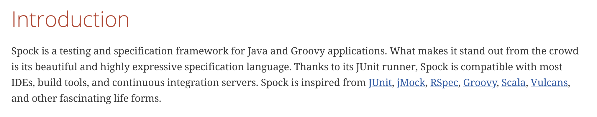

<!-- ---

title: Spock Framework를 이용한 테스트 코드 작성(작성중)

date: "2020-02-17T01:15:00.000Z"

layout: post

draft: false

path: "/posts/spock-intro"

category: "spock"

tags:

- "java"
- "spock"
- "groovy"
- "Spock"

description: "Spock Framework에 대한 간단한 소개와 작성 방법"

--- -->


> Spock Framework에 대한 간단한 소개와 작성 방법

## Introduction



출처 : [Spock 공식 문서](http://spockframework.org/spock/docs/1.3/all_in_one.html#_introduction)


Spock 공식 문서에 적혀있는 설명입니다. 간단히 말해 자바와 그루비 어플리케이션을 위한 테스트 프레임워크입니다. 

Spock의 경우 Groovy라는 언어로 작성되지만, Groovy를 한번도 들어본적 없거나 접해본적 없는 java 개발자의 경우라면 걱정할 필요는 없습니다. 사실 Groovy의 메인 설계 목표 자체가 java 진영의 스크립트형 언어가 되는 것입니다. 따라서 Groovy 라는 언어 자체가 익숙하게 느껴질 것입니다. 단순히 따라서 해도 좋고 Groovy에 대해 자세히 알고 싶다면 [Groovy documentation](http://groovy-lang.org/documentation.html) 을  참고하면 됩니다.

### Comparison to JUnit

Spock은 **BDD(Behaviour-Driven Development) 프레임워크**입니다.
TDD프레임워크인 JUnit과 비슷한 점이 많으나, **기대하는 동작과 테스트의 의도를 더 명확하게 드러내주고 산만한 코드는 뒤로 숨겨주는 등**의 큰 장점이 있습니다.

JUnit에 익숙한 사용자들을 위해 JUnit과의 용어비교를 먼저하겠습니다. Spock은 다른 용어를 사용하지만, JUnit에 많은 영감을 받았습니다.

| Spock               | JUnit                              |
| ------------------- | ---------------------------------- |
| Specification       | Test class                         |
| setup()             | @Before                            |
| cleanup()           | @After                             |
| setupSpec()         | @BeforeClass                       |
| cleanupSpec()       | @AfterClass                        |
| Feature             | Test                               |
| Feature method      | Test method                        |
| Data-driven feature | Theory                             |
| Condition           | Assertion                          |
| Exception condition | @Test(expected=...)                |
| Interaction         | Mock expectation (e.g. in Mockito) |


## Start Spock

그럼 Spock을 사용해보자. spock 사용을 위해 아래 의존성들을 추가해주면 됩니다.(Gradel 기준)

```groovy
// mandatory dependencies for using Spock
compile "org.codehaus.groovy:groovy-all:2.5.8"
testCompile platform("org.spockframework:spock-bom:2.0-M1-groovy-2.5")
testCompile "org.spockframework:spock-core"
testCompile "org.spockframework:spock-junit4" // you can remove this if your code does not rely on old JUnit 4 rules

```

그리고 Groovy 사용을 위한 플러그인이 필요합니다.

```groovy
apply plugin: 'groovy' // groovy
```


### Imports

```java
import spock.lang.*
```

`spock.lang` 패키지는 specification ( Test class와 비슷한 의미) 을 작성하는 중요한 타입들을 포함하고 있습니다. 


### Basic

#### Example

간단한 예시를 보면서 Spock에 대해 알아봅시다.

```groovy
class MyFirstSpecification extends Specification {
  // fields
  def obj = new Object()					--- (1)
  @Shared res = new VeryExpensiveResoure()		--- (2)
  static final PI = 3.141592654			--- (3)
  
  // fixture methods
  def setupSpec() {}		// runs once - before the first feature method
  def setup() {}				// runs before every feature method
  def cleanup() {}			// runs after every feature method
  def cleanupSpec() {}	// runs once - after the last feature method
  
  // featrue methods
  def "pushing an element on the stack"() {
    given:
    def stack = new Stack()
    def elem = "push me"
    
    when:  // stimulus
    stack.push()
    
    then:  // response
    !stack.empty
    stack.size() == 1
    stack.peek() == elem
  }
  
  // helper methods
  
}
```


### Fields

Instance 필드들은 specification의 fixture에 속한 객체들을 저장하는데에 적합합니다.


1. Instance 필드들에 저장된 객체들은 feature 메서드들간에 공유되지 않습니다. 대신 feature 메서드는 자신의 객체를 얻을 수 있습니다. feature 메서들을 서로 독립시키는 것에 도움이 됩니다.
2. 때때로 feature 메서드들간에 객체를 공유할 필요가 있습니다. 이를 위해 `@Shared` annotation을 이용하여 사용할 수 있습니다.
3. static 필드들은 상수로서만 사용되어야 합니다. 그렇지 않으면 공유의 의미가 더 잘 정의되어 있기 때문에 `@Shared` 필드가 선호됩니다.