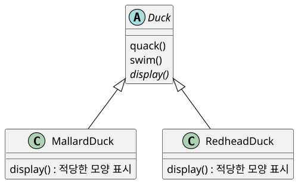
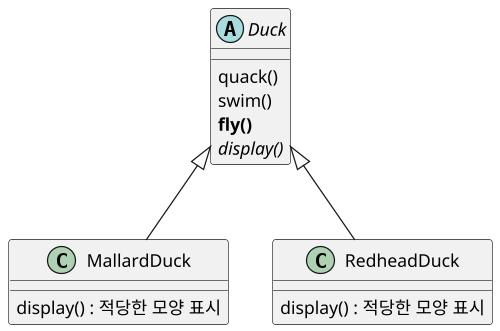
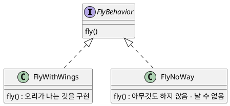
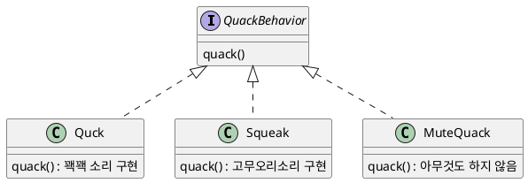
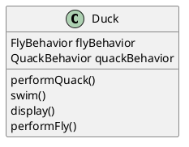
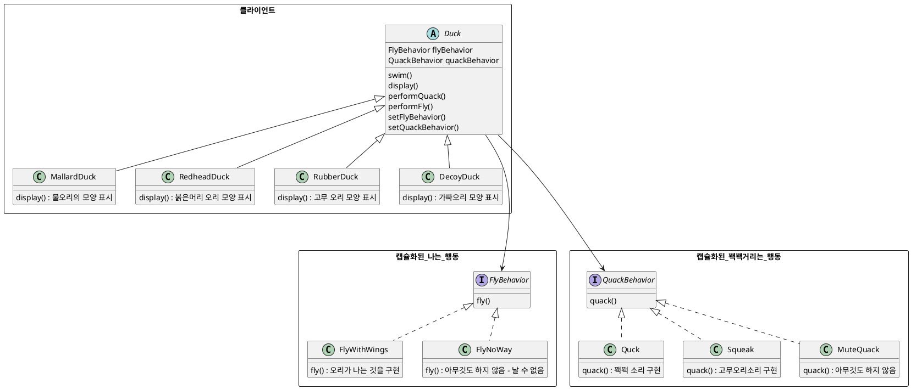

> Head First Design Patterns 책의 내용을 참고하였습니다.

# Strategy pattern (스트래티지 패턴)

Strategy pattern 에서는 알고리즘군을 정의하고 각각을 캡슐화하여 교환해서 사용할 수  있도록 만든다. Strategy pattern을 활용하면 알고리즘을 사용하는 클라이언트와는 독립적으로 알고리즘을 변경할 수 있다. 즉, 여기서의 알고리즘이란 각 객체들이 할 수 있는 행위을 말한다.

### 예시를 보면서 살펴보자.

오리 연못 시뮬레이션 게임은 만들어야 한다.

이 게임에서는 헤엄도 치고 꽥꽥거리는 소리도 내는 매우 다양한 오리 종류를 보여줄 수 있다. 처음의 설계는 Duck이라는 상위 클래스를 만들고 그 클래스를 확장하여 다른 모든 종류의 오리를 만들었다. 

두개의 오리 종류만 표현되었지만, 다른 수많은 유형들이 Duck 클래스로부터 상속을 받는다.

오리들이 날 수 있도록 하는 기능이 추가 되었다. 따라서, Duck 상위 클래스의 fly()라는 함수를 두었다.

하지만,  여기서 문제가 발생한다. 날지 말아야하는 오리들이 날게 되었다. 

Flyable, Quackable 이라는 인터페이스를 만들어 각각의 오리들이 이 인터페이스들을 구현하도록 하는 방법이 있지만, 이 방법 또한 문제가 있다.

자바 인터페이스에서는 구현된 코드가 전혀 들어가지 않기 때문에 이 인터페이스들을 구현하는 오리들의 코드에 중복이 발생하고 이 코드를 재사용할 수 없다는 점이다.

이를 해결하기 위해, Strategy pattern을 가져온다.

이 상황에서 어울릴 만한 디자인 원칙이 있다.

> 애플리케이션에서 달라지는 부분을 찾아내고, 달라지지 않는 부분으로부터 분리시킨다.  즉, 바뀌는 부분은 따로 뽑아서 캡슐화시킨다. 그렇게 하면 나중에 바뀌지 않는 부분에는 영향을 미치지 않은 채로 그 부분만 고치거나 확장할 수 있다.

fly() 와 quack()은 Duck 클래스에서 오리마다 달라지는 부분이다.

이러한 행동을 Duck 클래스로부터 갈래내기 위해서 그 두 메소드를 모두 Duck 클래스로부터 끄집어내서 각 행동을 나타낼 클래스 집합을 새로 만든다.

각 행동은 인터페이스로 표현하고 행동을 구현할 때 이런 인터페이스를 구현하도록 한다.

이제부터는 Duck의 행동은 (특정 행동 인터페이스를 구현한) 별도의 클래스 안에 들어있게 된다. 그렇게 하면 Duck 클래스에서는 그 행동을 구체적으로 구현하는 방법에 대해서는 더 이상 알고 있을 필요가 없다.

그럼 이제 어떻게 Duck에서 나는 행동과 꽥꽥 소리 내는 행동을 사용할 수 있을까?

1. 우선 Duck 클래스에서 `flyBehavior`와 `quackBehavior`라는 두 개의 인터페이스 형식의 인스턴스 변수를 추가한다. 각 오리 객체에서는 이 변수에 인터페이스를 구현한 특정 행동형식의 인스턴스로 설정한다.
2. Duck 클래스에 `fly()`와 `quack()` 대신 `performFly()`,` performQuack()`라는 메소드를 선언한다.

